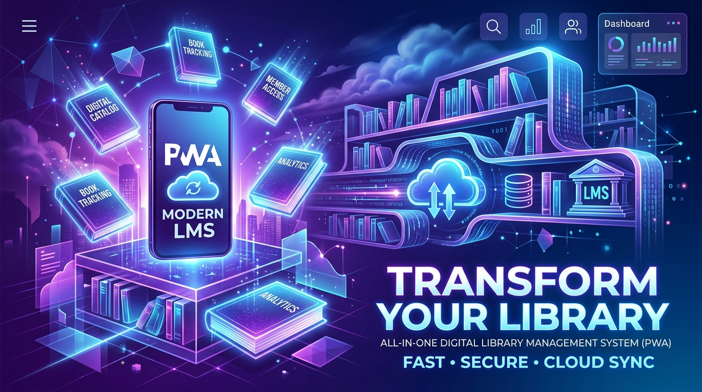

<div align="center">
  
  
  # 📚 Atsede Library Management System (PWA)
  
  <p>A feature-packed Progressive Web Application (PWA) designed for modern library operations, book indexing, and borrowing workflows.</p>

  
  
  
  
</div>

---

## ✨ Core Features

- 📖 **Catalog & Book Management**: Search books by title, category, author, and physical shelf/room location.
- 👥 **Multi-Role Portal**: Dedicated dashboards for **Admin**, **Librarian**, and **Library Members**.
- 🔔 **Push Notifications**: Integrated Web push notification service worker for alerts.
- 📑 **Docx Import Tool**: Bulk import books from Word documents directly into the database.
- 📱 **Offline Mode**: Works offline as a native-feeling Web App with manifest support (see *Offline* below).

## 🛠️ Setup Instructions

1. **Clone the Repository**:
   ```bash
   git clone https://github.com/shetesfa/atsede_library.git
   ```
2. **Setup Database**:
   - Create a local configuration file by copying `config.local.php.example` to `config.local.php` and filling your database credentials.
   - Run installation via browser or import the database schema from `database/`.
3. **Lock & Secure Installation Scripts**:
   > ⚠️ **SECURITY CRITICAL**: Immediately after installation, **DELETE** or lock `setup.php` and `setup_webhook.php` from the web root. An installation lock file `database/.installed` is created automatically, but removing these scripts from production web root is strongly recommended.
4. **Launch**:
   - Open in your browser: `http://localhost/atsede_library/`

## 📴 Offline

Open the app **once while online** (staff: visit it once and wait a few seconds) so the service worker, the catalog and the staff pages are cached. After that, offline:

- **Scan QR** (`scan.php`): books, copies and members are matched from the local IndexedDB copy.
- **Add books** (`librarian/books.php`): saved on the device, searchable and scannable immediately, with a QR sheet you can print. They are uploaded (with the cover photo) automatically when the connection returns. The server assigns the final copy codes; the QR identifier never changes.
- **Borrow / return / payments**: queued and synced in the order they were made.
- All UI assets (Bootstrap, icons, Ethiopic fonts) are self-hosted in `assets/lib/` — nothing is loaded from a CDN.

Not available offline: editing/deleting existing books, admin reports, Telegram/push, logging in for the first time.

After deploying, run `database/migrations/008_sync_events_rejected_status.sql` once.

---
<div align="center">
  <b>Developed with ❤️ by <a href="https://github.com/shetesfa">shetesfa</a></b>
</div>
